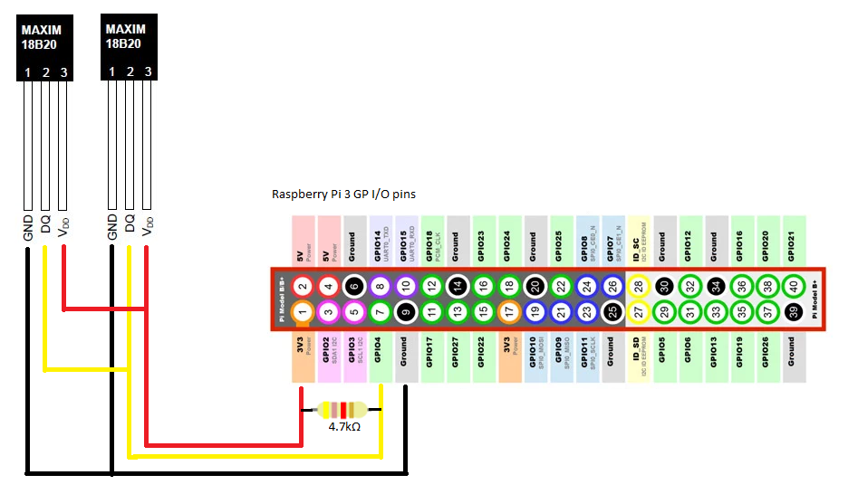

# heating-tempflow
This is a simple project that allows me to tune my underfloor-heating system.  
I want to measure the temperature of the water that flows in and out of every circuit of the heating system.
This information will be used to tune each circuit so that the inflow-temperature of each circuit is equal to 
the others.
This should result in a better balanced temperature throughout the house, and hopefully a lower gas bill.

Python scripts are used to read out sensor-output of multiple DS18B2 temperature-sensors that are measuring
the in- and outflow temperature of all the underfloor-heating circuits that are present in the house.

The sensor-data is submitted to an InfluxDB timeseries database and Grafana is used to visualize the data.
Using this information allows me to make sure that the inflow-water temperature for all heating-circuits are
evenly divided

Everything runs on a Raspberry Pi.

# DS18B2 sensors

the DS18B2 sensor is a 1-wire sensor that is able to measure temperatures between -50°C to +125°C.
Multiple sensors can be connected in parallel.
A 4.7k ohm resistor is necessary between the data and the VCC wire:

>Another feature of the DS18B20 is the ability to operate
>without an external power supply. Power is instead
>supplied through the 1-Wire pullup resistor through the
>DQ pin when the bus is high. The high bus signal also
>charges an internal capacitor (CPP), which then supplies
>power to the device when the bus is low. This method of
>deriving power from the 1-Wire bus is referred to as “parasite
>power.” As an alternative, the DS18B20 may also be
>powered by an external supply on VDD.

See the wiring scheme below:

# InfluxDB
InfluxDB is a time-series database that is a perfect fit for this project: I want to measure temperatures at a specified interval
and store those temperatures in a database.
A relational database could be used to achieve this, but a timeseries database is designed specifically for this kind of data.
Key concepts of InfluxDB are explained [here](https://docs.influxdata.com/influxdb/v1.3/concepts/key_concepts/)

The InfluxDB database for this project contains one series whose schema looks like this:

Communication with InfluxDB is done via a REST API.  I find it easy to use Postman to try out the InfluxDB API.

Create the database:

POST http://localhost:8086/query?q=CREATE DATABASE heatflow

Get list of available databases

GET http://localhost:8086/query?q=SHOW DATABASES

InfluxDB is a schemaless database which means you do not have to create the schema of the series up front.  Measurements, tags and fields 
can be created any time.

The data that I want to keep track of in the heatflow database is quite simple:
I want to know what temperature was measured by all DS18B2 sensors at a specific point in time.

Writing the data to the InfluxDB database is fairly simple:

POST http://localhost:8086/write?db=heatflow

The body of the above POST command contains the data that must be stored:

	'sensordata,sensorid=abcd value=23.5'

The above Line Protocol states that data will be written in the measurement (series) 'sensordata'.  The tag key 'sensorid' has the value abc and 
the field key 'value' is assigned the field value 23.5

InfluxDB can be found [here](https://www.influxdata.com/).

Information on how to write data to InfluxDB using the REST API can be found [here](https://docs.influxdata.com/influxdb/v1.3/guides/writing_data/)
